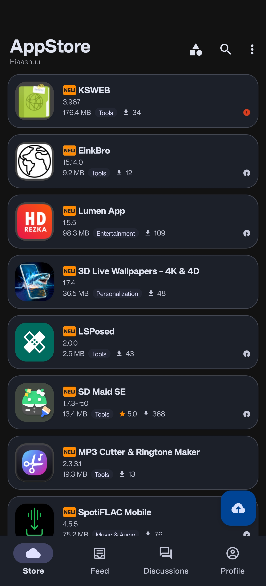
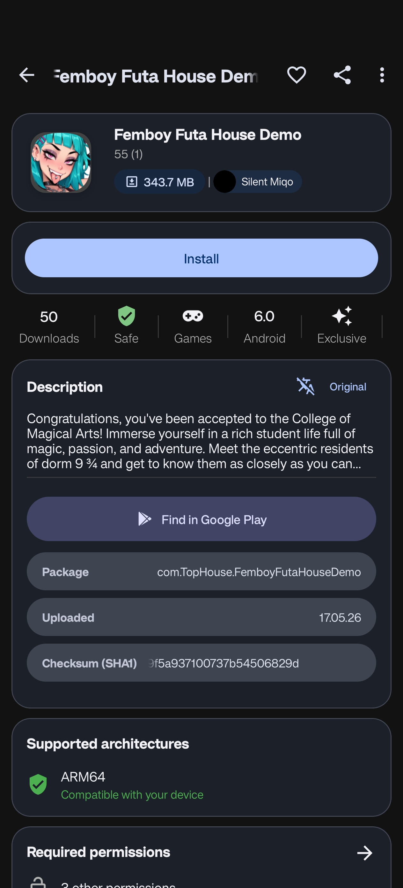
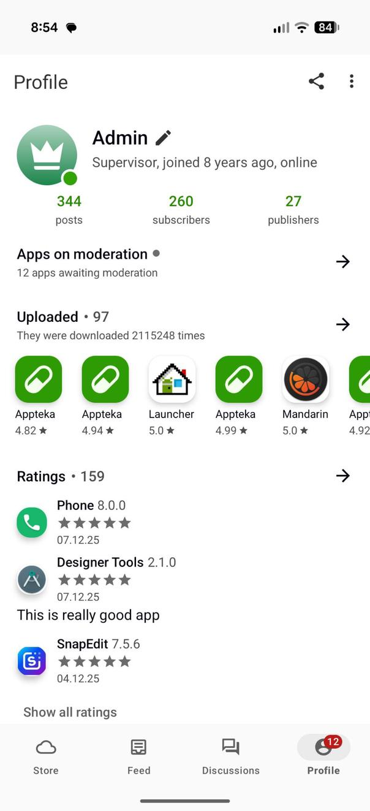
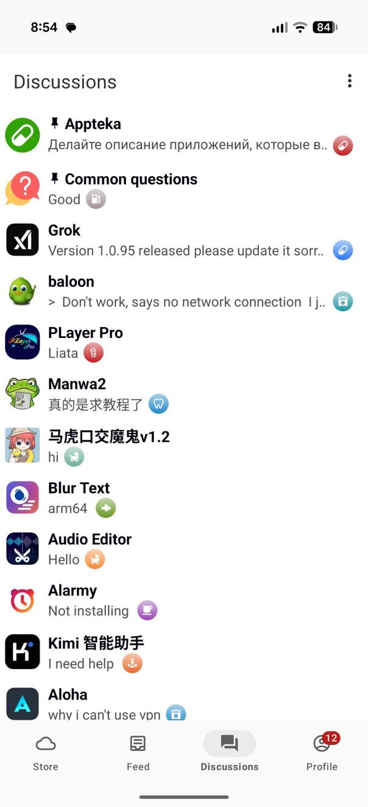

<p align="center">
  
</p>

<h1 align="center">ApptekaApp</h1>

<p align="center">
  <strong>A Custom Styled Alternative Android App Store & APK Extractor</strong>
</p>

<p align="center">
  <a href="https://github.com/solkin/appteka-android">
    
  </a>
  <a href="#-license">
    
  </a>
  
  
  
</p>

---

> [!IMPORTANT]
> **Acknowledgement & Credits**
>
> This repository, **ApptekaApp**, is a modified and personalized fork of the original open-source project **[Appteka](https://github.com/solkin/appteka-android)** by **[Igor Solkin (@solkin)](https://github.com/solkin)**.
>
> **What was changed in this fork:**
> - Complete change of the application's Package Name
> - Personalized UI/UX styling, color schemes, and layout adjustments
> - Custom tweaks to suit individual preferences & Material You Dynamic Theming
>
> *All core architectural credits, backend API integrations, and original application logic belong entirely to the original author. Massive thanks for making this amazing project open-source!*

---

## 📖 About

**ApptekaApp** is a free, open-source Android app store where users can discover, download, and share applications. Upload your own apps, explore creations from developers worldwide, and engage with the community through real-time discussions — now with a fresh, custom-styled Material You interface.

---

## 📸 Screenshots

> Replace the images in your `art/` folder with screenshots of your custom-styled build.

<p align="center">
  
  &nbsp;
  
  &nbsp;
  
  &nbsp;
  
</p>

---

## ✨ Features

| Feature | Description |
|---|---|
| 🛍️ **Browse & Download** | Explore hundreds of thousands of free Android apps |
| 📤 **Upload Apps** | Share your applications with the community |
| 📦 **APK Extractor** | Extract APKs from installed apps (including system apps) |
| 💬 **Real-time Chat** | Discuss apps and games with other users |
| 👤 **User Profiles** | Track uploads, downloads, and activity |
| ⭐ **Ratings & Reviews** | Rate apps and read community feedback |
| ❤️ **Favorites** | Save apps for later |
| 🎨 **Material You Theming** | Full dark mode support & dynamic system colors |
| 🔓 **No Root Required** | Works on any standard Android device |

---

## 📥 Download

<p>
  <a href="https://appteka.store">
    
  </a>
</p>

Or compile the latest APK directly from this repository. See [Building](#️-building) below.

---

## 🛠️ Tech Stack

| Category | Technologies |
|---|---|
| **Language** | Kotlin 1.9 |
| **UI** | Material Design 3, AndroidX |
| **Architecture** | MVP (Model-View-Presenter), Clean Architecture |
| **Dependency Injection** | Dagger 2 |
| **Reactive** | RxJava 3, RxKotlin, RxRelay |
| **Networking** | Retrofit 2, OkHttp 4 |
| **Image Loading** | Simple Image Loader |
| **Build** | Gradle, ProGuard |

---

## 🏗️ Architecture

The project follows **Clean Architecture** principles with an **MVP** pattern:

```
┌──────────────────────────────────────────────┐
│           Activity / Fragment                │
│   (Router — implements navigation interface) │
└──────────────┬───────────────────────────────┘
               │
┌──────────────▼───────────────────────────────┐
│              Presenter                       │
│   (Presentation layer — framework-agnostic)  │
└──────────────┬───────────────────────────────┘
               │
┌──────────────▼───────────────────────────────┐
│              Interactor                      │
│   (Business logic, repository, data cache)   │
└──────────────┬───────────────────────────────┘
               │
┌──────────────▼───────────────────────────────┐
│           Data / Converter                   │
│   (Data mapping between layers)              │
└──────────────────────────────────────────────┘
```

- **View** — Pure UI rendering, zero business logic
- **ResourceProvider** — Android resources access for framework-agnostic layers

---

## ⚙️ Building

### Requirements

| Tool | Version |
|---|---|
| Android Studio | Ladybug or newer |
| JDK | 17 |
| Android SDK | API 35 |

### Build & Run

```bash
# Clone the repository
git clone https://github.com/YOUR_USERNAME/ApptekaApp.git
cd ApptekaApp

# Build debug APK
./gradlew assembleDebug

# Build release APK (requires signing config in local.properties)
./gradlew assembleRelease
```

> The APK will be generated at `app/build/outputs/apk/`

---

## 🌍 Localization

ApptekaApp is available in **9 languages**:

| Language | Code |
|---|---|
| English | `en` *(default)* |
| Russian | `ru` |
| Arabic | `ar` |
| Chinese | `zh` |
| Farsi | `fa` |
| Hindi | `hi` |
| Kurdish | `ku` |
| Portuguese (Brazil) | `pt-rBR` |
| Vietnamese | `vi` |

Want to help translate? Contributions are welcome — see [Contributing](#-contributing) below.

---

## 🤝 Contributing

Contributions are welcome! Feel free to:

- 🐛 **Report bugs** and request features via [Issues](../../issues)
- 🔀 **Submit pull requests** with improvements
- 🌍 **Help with translations**
- 📝 **Improve documentation**

Please follow standard GitHub flow: fork → branch → PR.

---

## 🔒 Security & Disclaimer

All uploaded applications are automatically scanned by a built-in antivirus system powered by **three independent antivirus engines**.

However, Appteka is a **community-driven** app exchange platform where users can freely upload applications. The Appteka team and the maintainer of this fork are **not responsible** for user-generated content. While security scanning and content moderation are in place:

> ⚠️ **Always verify the source, check reviews and ratings before installing any app.**

- [Terms of Service](https://appteka.store/terms)
- [DMCA Policy](https://appteka.store/dmca)
- [Contacts & Donations](https://appteka.store/contacts)

---

## 📄 License

Since this project is a fork of Appteka, it inherits the same open-source license.

```
GNU GENERAL PUBLIC LICENSE
Version 3, 29 June 2007

Copyright (C) 2007 Free Software Foundation, Inc. <http://fsf.org/>
```

<details>
<summary>📜 View Full GPL v3 License Text</summary>

```
GNU GENERAL PUBLIC LICENSE
Version 3, 29 June 2007

Copyright (C) 2007 Free Software Foundation, Inc. <http://fsf.org/>
Everyone is permitted to copy and distribute verbatim copies of this
license document, but changing it is not allowed.

                        Preamble

The GNU General Public License is a free, copyleft license for software
and other kinds of works.

The licenses for most software and other practical works are designed to
take away your freedom to share and change the works. By contrast, the
GNU General Public License is intended to guarantee your freedom to share
and change all versions of a program — to make sure it remains free
software for all its users. We, the Free Software Foundation, use the
GNU General Public License for most of our software; it applies also to
any other work released this way by its authors. You can apply it to
your programs, too.

When we speak of free software, we are talking about freedom, not price.
Our General Public Licenses are designed to make sure that you have the
freedom to distribute copies of free software (and charge for them if
you wish), that you receive source code or can get it if you want it,
that you can change the software or use pieces of it in new free
programs, and that you know you can do these things.

To protect your rights, we need to prevent others from denying you these
rights or asking you to surrender the rights. Therefore, you have certain
responsibilities if you distribute copies of the software, or if you
modify it: responsibilities to respect the freedom of others.

For the complete license text, please visit:
https://www.gnu.org/licenses/gpl-3.0.txt
```

</details>

[](https://www.gnu.org/licenses/gpl-3.0)

---

<p align="center">
  Night-coded by the Appteka team 🌙 &nbsp;|&nbsp; Modified with ❤️ for <strong>ApptekaApp</strong>
</p>
